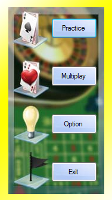
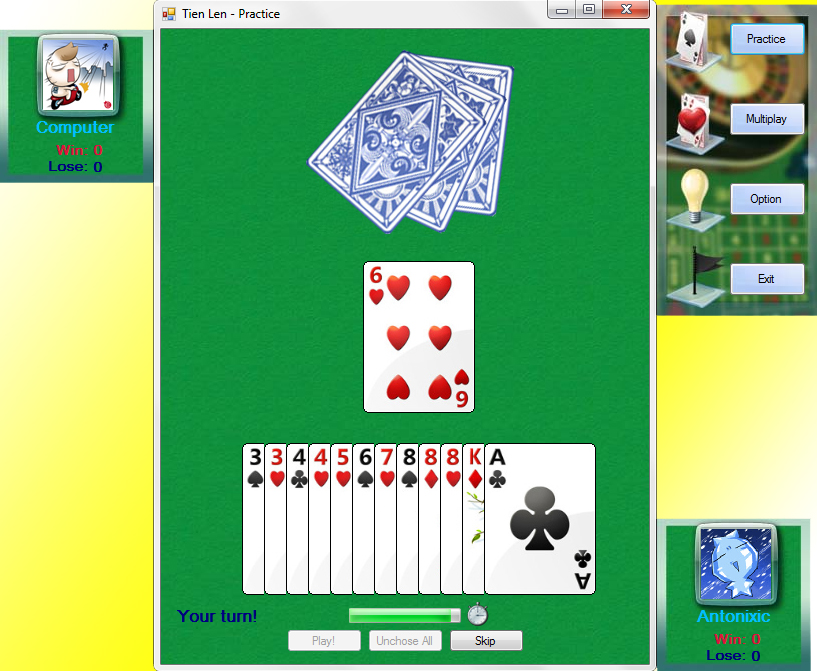
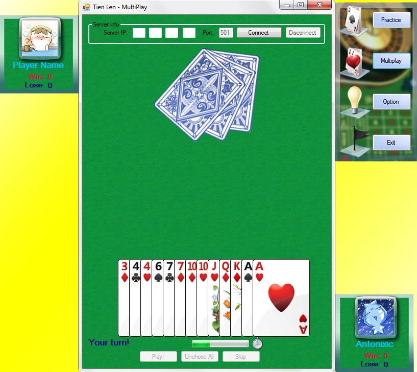
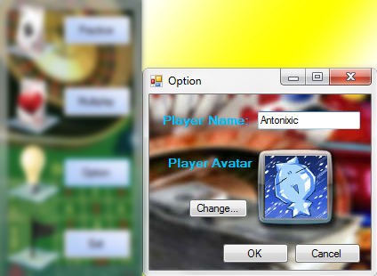
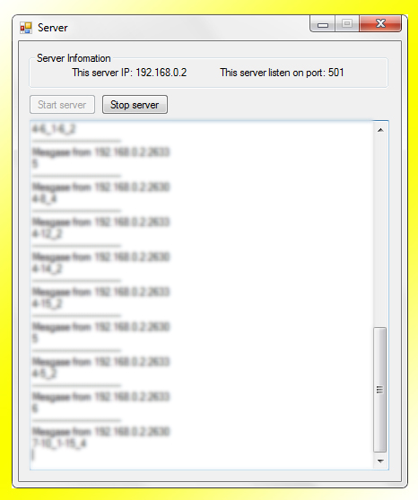
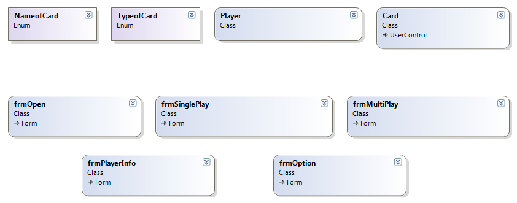

## CS_Winform_TienLenCardGame

Tien Len is a popular card game in Vietnam. I created this project to help new player learn how to play (via Single mode-play with computer) and practice with other friend (via Multiplayer mode through a server)

Menu

Single play

Multiple - play

Option

Server log

Class Diagram

